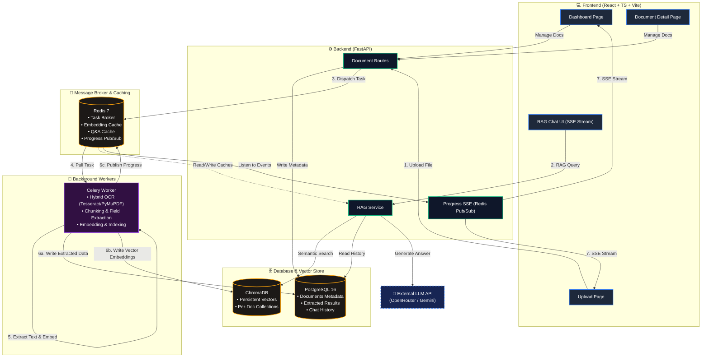
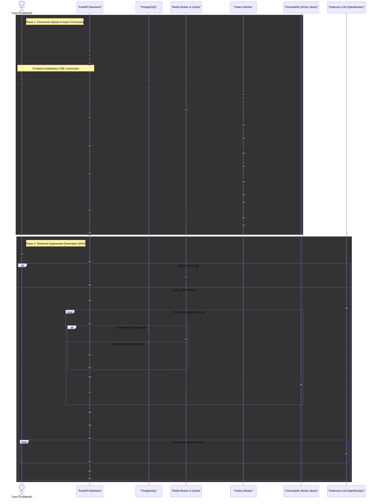
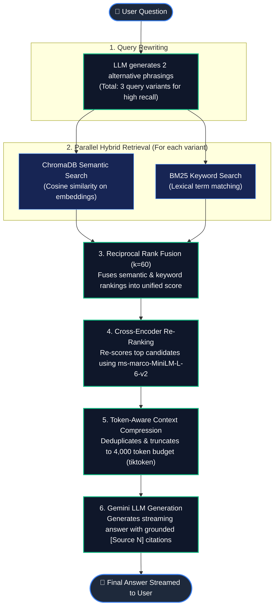

# 📄 DocProcessor — Intelligent Document Processing & RAG Platform

A **production-grade full-stack application** for uploading, processing, and intelligently querying documents using a custom-built **Retrieval-Augmented Generation (RAG) pipeline**. Features async processing, real-time progress streaming, hybrid search, cross-encoder re-ranking, and streaming LLM responses.

> **Built with:** React · FastAPI · PostgreSQL · Redis · Celery · ChromaDB · Sentence Transformers · OpenRouter/Gemini

---

## 🏗️ System Architecture

### 📡 Component Architecture



### 🔄 End-to-End Data Flow Sequence



---

## 🔥 Key Features

### Document Processing Pipeline
- **Multi-file upload** with drag-and-drop, file validation, and size limits
- **Async background processing** via Celery workers with real-time progress
- **Live progress tracking** via Redis Pub/Sub → Server-Sent Events (SSE)
- **Text extraction** from PDF, DOCX, HTML, and plain text files
- **Hybrid OCR Engine**: Intelligent extraction using **PyMuPDF** for digital layers and **Tesseract OCR** for image-based content (scanned PDFs, PNG, JPG)
- **NLP field extraction** — automatic title, category, summary, and keyword extraction
- **Review & edit** extracted results before finalizing
- **Export** as JSON or CSV (single document or bulk)
- **Document deletion** with full RAG index cleanup (ChromaDB + Redis cache purge)

### RAG Chat System (Production-Grade)
| Pipeline Stage | Implementation |
|---|---|
| **1. Query Rewriting** | LLM-powered query expansion into multiple variations for better recall |
| **2. Semantic Chunking** | Sentence-aware dynamic chunking with configurable overlap |
| **3. Batched Embeddings** | `all-MiniLM-L6-v2` with Redis-cached embeddings (7-day TTL) |
| **4. Hybrid Retrieval** | Semantic search (ChromaDB) + BM25 keyword search |
| **5. Rank Fusion** | Reciprocal Rank Fusion (RRF) to merge semantic + keyword results |
| **6. Re-Ranking** | Cross-encoder (`ms-marco-MiniLM-L-6-v2`) for precision |
| **7. Context Building** | Token-aware compression with deduplication (tiktoken) |
| **8. LLM Generation** | Streaming responses via Gemini with source citations |
| **9. Session Persistence** | URL-based routing (`/chat/:id`) ensures history survives refreshes |
| **10. Multi-Layer Caching** | Redis cache for embeddings + Q&A answers |

### Dashboard & UX
- **Search, filter, sort, paginate** documents
- **Status tracking** — Queued → Processing → Completed / Failed
- **Finalization workflow** — lock edits after review approval
- **Retry failed jobs** with one click
- **Delete documents** with confirmation modal and full RAG cleanup
- **Chat with conversation history** — URL-persistent sessions (`/chat/:id`) with sidebar navigation
- **Document-scoped queries** — search all documents or select specific ones

---

## 🛠️ Tech Stack

| Layer | Technology | Purpose |
|---|---|---|
| **Frontend** | React 18, TypeScript, Vite | SPA with real-time updates |
| **UI Components** | Lucide React, Custom CSS | Modern, responsive design system |
| **Backend API** | FastAPI (Python 3.12) | Async REST API with auto-generated docs |
| **OCR Engine** | Tesseract OCR + PyMuPDF | Hybrid text extraction from images/PDFs |
| **Database** | PostgreSQL 16 | Document metadata, processing results, chat history |
| **Vector Store** | ChromaDB | Persistent vector embeddings per document |
| **Task Queue** | Celery | Distributed async document processing |
| **Message Broker** | Redis 7 | Task broker, Pub/Sub, embedding cache, Q&A cache |
| **Embeddings** | Sentence Transformers (`all-MiniLM-L6-v2`) | Semantic embeddings for retrieval |
| **Re-Ranking** | Cross-Encoder (`ms-marco-MiniLM-L-6-v2`) | Precision re-ranking of search results |
| **Keyword Search** | BM25 (rank-bm25) | Lexical search for hybrid retrieval |
| **LLM** | Gemini via OpenRouter | Query rewriting + answer generation |
| **Tokenizer** | tiktoken (`cl100k_base`) | Token-aware context window management |
| **Streaming** | SSE (sse-starlette) | Real-time progress + streaming chat responses |
| **Deployment** | Docker Compose | One-command full-stack deployment |

---

## 📁 Project Structure

```
docprocessor/
├── backend/
│   ├── app/
│   │   ├── main.py                 # FastAPI application entry
│   │   ├── config.py               # Centralized settings (env-based)
│   │   ├── database.py             # Async SQLAlchemy engine + sessions
│   │   ├── models.py               # ORM models (Document, ProcessingResult, Chat)
│   │   ├── schemas.py              # Pydantic request/response schemas
│   │   ├── routes/
│   │   │   ├── documents.py        # Document CRUD + upload + delete
│   │   │   ├── chat.py             # RAG chat + streaming + sessions
│   │   │   └── progress.py         # SSE progress streaming
│   │   ├── services/
│   │   │   ├── document_service.py # Business logic layer
│   │   │   ├── rag_service.py      # Full RAG pipeline (711 lines)
│   │   │   └── export_service.py   # JSON/CSV export logic
│   │   └── worker/
│   │       ├── celery_app.py       # Celery configuration
│   │       └── tasks.py            # Document processing task pipeline
│   ├── requirements.txt
│   └── Dockerfile
├── frontend/
│   ├── src/
│   │   ├── api/client.ts           # Axios API client + SSE streaming
│   │   ├── pages/
│   │   │   ├── DashboardPage.tsx   # Document list with search/filter
│   │   │   ├── DocumentDetailPage.tsx  # Detail view with edit/delete
│   │   │   ├── ChatPage.tsx        # RAG chat with streaming
│   │   │   └── UploadPage.tsx      # File upload
│   │   ├── components/             # Reusable UI components
│   │   ├── hooks/                  # Custom React hooks
│   │   ├── types/index.ts          # TypeScript type definitions
│   │   └── styles/index.css        # Design system (1500+ lines)
│   ├── package.json
│   └── Dockerfile
├── docker-compose.yml              # Full-stack orchestration
└── sample_files/                   # Test documents
```

---

## 🚀 Getting Started

### Prerequisites
- Docker & Docker Compose
- (Optional) OpenRouter API key for LLM features

### Quick Start

```bash
# 1. Clone the repository
git clone https://github.com/kshitij189/doc-processor.git
cd doc-processor

# 2. Set up environment (optional — for LLM chat features)
echo "OPENROUTER_API_KEY=your_key_here" > .env

# 3. Start all services (Tesseract is automatically installed in Docker)
docker compose up --build -d

# 4. Open the application
#    Frontend:  http://localhost:5173
#    API Docs:  http://localhost:8000/docs
#    Backend:   http://localhost:8000
```

### Local Development (without Docker)

```bash
# Backend
cd backend
python -m venv venv
venv\Scripts\activate            # Windows
pip install -r requirements.txt
uvicorn app.main:app --reload --port 8000

# Celery Worker (separate terminal)
celery -A app.worker.celery_app worker --loglevel=info

# Frontend (separate terminal)
cd frontend
npm install
npm run dev
```

> **Note:** PostgreSQL and Redis must be running locally for development mode.

---

## 📡 API Reference

### Document Management

| Method | Endpoint | Description |
|---|---|---|
| `POST` | `/api/documents/upload` | Upload one or more files |
| `GET` | `/api/documents` | List documents (search, filter, sort, paginate) |
| `GET` | `/api/documents/{id}` | Get document with processing result |
| `DELETE` | `/api/documents/{id}` | Delete document + RAG index + file |
| `POST` | `/api/documents/{id}/retry` | Retry a failed processing job |
| `PUT` | `/api/documents/{id}/result` | Edit extracted result fields |
| `POST` | `/api/documents/{id}/finalize` | Finalize a reviewed document |
| `GET` | `/api/documents/{id}/export` | Export single document (JSON/CSV) |
| `GET` | `/api/documents/export/bulk` | Bulk export all finalized documents |

### RAG Chat

| Method | Endpoint | Description |
|---|---|---|
| `POST` | `/api/chat` | Send a question (non-streaming) |
| `POST` | `/api/chat/stream` | Send a question (streaming SSE) |
| `GET` | `/api/chat/status` | RAG pipeline status (collections, chunks) |
| `POST` | `/api/chat/sessions` | Create a new chat session |
| `GET` | `/api/chat/sessions` | List all chat sessions |
| `GET` | `/api/chat/sessions/{id}` | Get session with message history |

### Progress Tracking

| Method | Endpoint | Description |
|---|---|---|
| `GET` | `/api/progress/{document_id}` | SSE stream for processing progress |

---

## 🧠 RAG Pipeline Deep Dive

### How a Query is Processed



### Chunking Strategy

Documents are split using **sentence-aware dynamic chunking**:
- Splits on sentence boundaries (`.` `!` `?`) — never mid-word
- Respects max chunk size (500 chars) with configurable overlap (50 chars)
- Long sentences are sub-chunked by word boundaries
- Overlap ensures context continuity between chunks

### Caching Strategy (3 Layers)

| Cache | Key | TTL | Purpose |
|---|---|---|---|
| **Embedding Cache** | `emb:{sha256(text)[:16]}` | 7 days | Avoid re-computing embeddings for duplicate text |
| **Q&A Cache** | `qa:{sha256(query+doc_ids)[:16]}` | 1 hour | Cache answers for repeated questions |
| **Collection Cache** | ChromaDB persistent storage | Permanent | Pre-computed vector index per document |

### Document Deletion Cleanup

When a document is deleted, the system performs **3-layer cleanup**:
1. **Redis** — Deletes all embedding cache entries for the document's chunks
2. **ChromaDB** — Drops the entire vector collection for the document
3. **Redis Q&A** — Flushes stale answer cache to prevent serving outdated results

---

## 🗄️ Database Schema

```sql
-- Core document tracking
documents
├── id (UUID, PK)
├── filename, file_path, file_type, file_size
├── status (queued → processing → completed / failed)
├── is_finalized (boolean)
├── celery_task_id
├── error_message
└── created_at, updated_at

-- Extracted processing results (1:1 with documents)
processing_results
├── id (UUID, PK)
├── document_id (FK → documents, CASCADE DELETE)
├── title, category, summary
├── keywords (JSONB array)
├── meta_data (JSONB — word_count, char_count, line_count)
├── raw_text
└── created_at, updated_at

-- Persistent chat sessions
chat_sessions
├── id (UUID, PK)
├── title
└── created_at, updated_at

-- Chat message history
chat_messages
├── id (UUID, PK)
├── session_id (FK → chat_sessions, CASCADE DELETE)
├── role (user / assistant)
├── content
├── context_docs (JSONB — source citations)
└── created_at
```

---

## ⚙️ Design Decisions

| Decision | Rationale |
|---|---|
| **SSE over WebSocket** | Simpler for unidirectional streaming; built-in browser reconnection; works through HTTP proxies |
| **Hybrid Retrieval (Semantic + BM25)** | Pure vector search misses exact keyword matches; BM25 complements with lexical precision |
| **RRF over learned fusion** | Parameter-free, robust rank fusion — no training data needed |
| **Cross-encoder re-ranking** | Dramatically improves precision over bi-encoder alone at acceptable latency |
| **Per-document collections** | Clean isolation — deleting a document cleanly drops its entire collection |
| **Redis embedding cache** | Avoids redundant GPU/CPU computation when re-processing similar content |
| **Sentence-aware chunking** | Preserves semantic coherence vs. fixed-size character splitting |
| **Async FastAPI + Sync Celery** | FastAPI handles I/O-bound web requests; Celery workers handle CPU-bound processing |
| **Docker Compose** | One-command deployment of 5 services with health checks and volume persistence |
| **Hybrid OCR** | Balances performance by using digital text where available and Tesseract only for embedded images |
| **URL-Based State** | Uses `react-router` to manage `sessionId`, providing a robust UX that survives page refreshes |

---

## 📊 Processing Pipeline Stages

Each document goes through these stages (published as real-time SSE events):

```
1. job_started              → Status: processing
2. document_parsing_started → Hybrid OCR / Text extraction begins
3. document_parsing_completed → Raw text extracted
4. field_extraction_started → NLP analysis begins
5. field_extraction_completed → Title, category, summary, keywords extracted
6. rag_indexing_started     → Chunking + embedding begins
7. rag_indexing_completed   → Stored in ChromaDB
8. storing_result           → Persisted to PostgreSQL
9. job_completed            → Status: completed
```

---

## 🔒 Known Limitations

- No authentication/authorization (would add JWT + RBAC in production)
- File storage is local Docker volume (swap for S3/GCS in production)
- Single Celery worker (horizontally scalable via `--concurrency` or replicas)
- No rate limiting on upload endpoint
- Single-tenant system (no multi-user isolation)

---

## 📜 License

This project is for portfolio and educational purposes.
